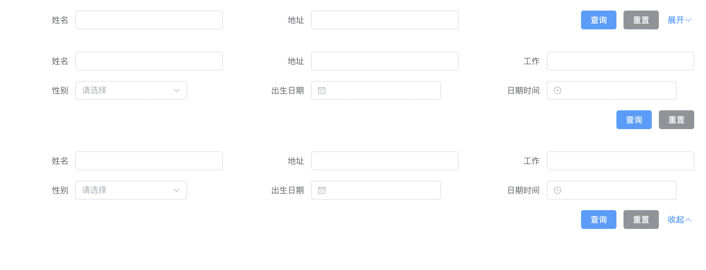

# vue3+vite+element-puls 折叠展开的查询组件封装学习

基于前面封装的 pro-form 做了修改，将 pro-form 修改为表单项使用 row col 包括的，达到一行多个的效果
defaultColsNumber 配置默认展示多少个，没有配置则默认显示 1 行
通过设置组件的 hidden 属性来控制显示隐藏，
but，row 配置了 gutter 之后 col 的 hidden 属性就失效，不知道为啥，解决不了

话不多说，上代码

## 代码实现

```vue
<template>
  <pro-form
    ref="queryFilterRef"
    :config="config"
    :fields="computedFields"
    :col-size="colSize"
    :submitter-col-size="{ offset, ...(submitterColSize || colSize) }"
    :submitter-style="{
      textAlign: 'end',
      display: 'flex',
      justifyContent: 'end',
    }"
    @submit="$emit('submit', queryFilterRef?.formValues)"
    @reset="$emit('reset')"
  >
    <template #submitter>
      <pro-form-submitter
        v-bind="{ okText: '查询', cancelText: '重置', ...submitter }"
        @submit="queryFilterRef?.onSubmit?.()"
        @reset="queryFilterRef?.onReset?.()"
      ></pro-form-submitter>
      <el-button
        v-if="needCollapseRender"
        type="primary"
        link
        @click="onChangeCollapsed"
      >
        {{ collapsed ? '展开' : '收起' }}
        <Icon :icon="collapsed ? 'ArrowDown' : 'ArrowUp'"></Icon>
      </el-button>
    </template>
  </pro-form>
</template>

<script setup lang="ts">
import { ProForm, ProFormSubmitter, Icon } from '@/components'
import { IFormProps, IFormEmits, IFormExpose } from '../ProForm/type'
import { withDefaults, computed, ref } from 'vue'

interface IQueryFilterProps extends IFormProps {
  defaultColsNumber?: number
  defalutCollapsed?: boolean
}

interface IQueryFilterEmits extends Omit<IFormEmits, 'request'> {
  (e: 'onCollapseChange', v: boolean): void
}

const props = withDefaults(defineProps<IQueryFilterProps>(), {
  colSize: { span: 8 },
  defalutCollapsed: true,
})

const emit = defineEmits<IQueryFilterEmits>()

const queryFilterRef = ref<IFormExpose<Record<string, any>>>()
const collapsed = ref(props.defalutCollapsed)
let totalSpan = ref(0)
let currentSpan = ref(0)

// 展示多少form-item
const showLength = computed(() => {
  if (props.defaultColsNumber !== undefined) {
    return props.defaultColsNumber
  }
  /**
   * 没传defaultColsNumber
   * 如果按钮的span > form-item的span 就直接下一行渲染按钮
   * 如果<= 就一行渲染 -1 是为了给查询按钮留空间
   */
  const submitterColSpan = props.submitterColSize?.span || props.colSize.span
  const len = 24 / props.colSize.span
  return Math.max(1, submitterColSpan > props.colSize.span ? len : len - 1)
})

/** 是否需要展示 collapseRender */
const needCollapseRender = computed(() => {
  if (totalSpan.value < 24 || props.fields.length <= showLength.value) {
    return false
  }
  return true
})

const getShowFields = () => {
  totalSpan.value = 0
  currentSpan.value = 0
  return props.fields?.map((item, idx) => {
    const colSpan = props.colSize.span
    totalSpan.value += colSpan
    const hidden: boolean =
      item?.fieldProps?.hidden ||
      // 如果收起了
      (collapsed.value &&
        // 如果 超过显示长度 且 总长度超过了 24
        idx >= showLength.value &&
        totalSpan.value >= 24)

    if (24 - (currentSpan.value % 24) < colSpan) {
      // 如果当前行空余位置放不下，那么折行
      totalSpan.value += 24 - (currentSpan.value % 24)
      currentSpan.value += 24 - (currentSpan.value % 24)
    }
    if (!hidden) {
      currentSpan.value += colSpan
    }

    return {
      ...item,
      hidden: hidden,
    }
  })
}

const computedFields = computed({
  get: () => getShowFields(),
  set: (val) => val,
})

const getOffset = () => {
  const colSpan = props.submitterColSize?.span || props.colSize.span
  // 最后一行剩余多少span
  const residueSpan = currentSpan.value % 24

  const offsetSpan = 24 - residueSpan - colSpan

  return offsetSpan
}

const offset = computed({
  get: () => getOffset(),
  set: (val) => val,
})

const onChangeCollapsed = () => {
  collapsed.value = !collapsed.value
  emit('onCollapseChange', collapsed.value)
}
</script>
<style scoped></style>
```

## 使用

```vue
<template>
  <query-filter
    label-width="150px"
    :fields="fields.slice(0, 5)"
    @submit="onSubmit"
  >
  </query-filter>
  <query-filter
    label-width="150px"
    :fields="fields"
    :default-cols-number="6"
    @submit="onSubmit"
  >
  </query-filter>
  <query-filter
    :defalut-collapsed="false"
    :submitter-col-size="{ span: 12 }"
    label-width="150px"
    :fields="fields"
    @submit="onSubmit"
    @onCollapseChange="onCollapseChange"
  >
  </query-filter>
</template>

<script setup lang="ts">
import { QueryFilter } from '@/components'
import { reactive } from 'vue'

let fields = reactive([
  {
    label: '姓名',
    prop: 'name',
    type: 'input',
  },
  {
    label: '地址',
    prop: 'address',
    type: 'input',
  },
  {
    label: '工作',
    prop: 'job',
    type: 'input',
  },
  {
    label: '性别',
    prop: 'gender',
    type: 'select',
    fieldProps: {
      options: [
        { label: '男', value: 0 },
        { label: '女', value: 1 },
      ],
    },
  },
  {
    label: '出生日期',
    prop: 'date',
    type: 'datePicker',
    fieldProps: {
      type: 'date',
      clearable: true,
    },
  },
  {
    label: '日期时间',
    prop: 'dateTime',
    type: 'datePicker',
    fieldProps: {
      type: 'datetime',
      clearable: true,
      format: 'YYYY-MM-DD HH:mm:ss',
    },
  },
])

const onSubmit = (values) => {
  console.log('QueryFilter=====onSubmit===>', values)
}
const onCollapseChange = (v) => {
  console.log('onCollapseChange==>', v)
}
</script>
<style scoped></style>
```

## 效果


