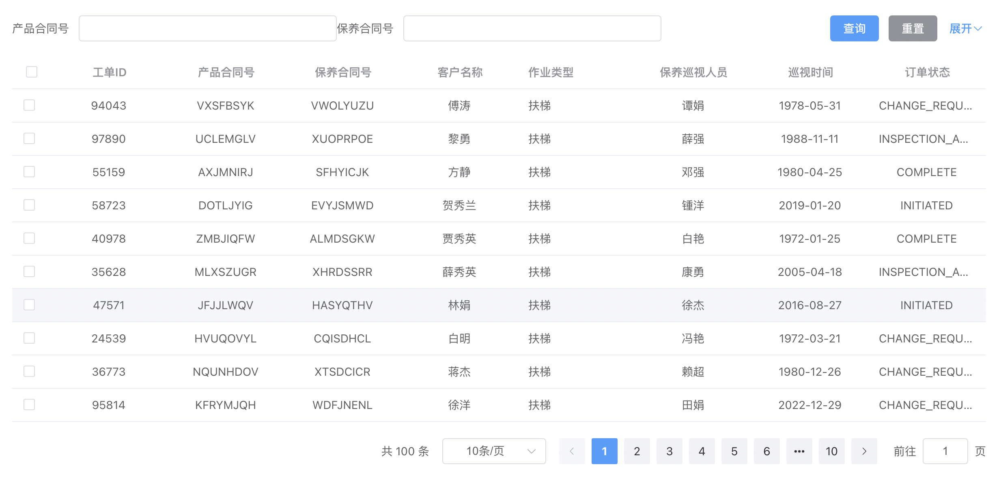
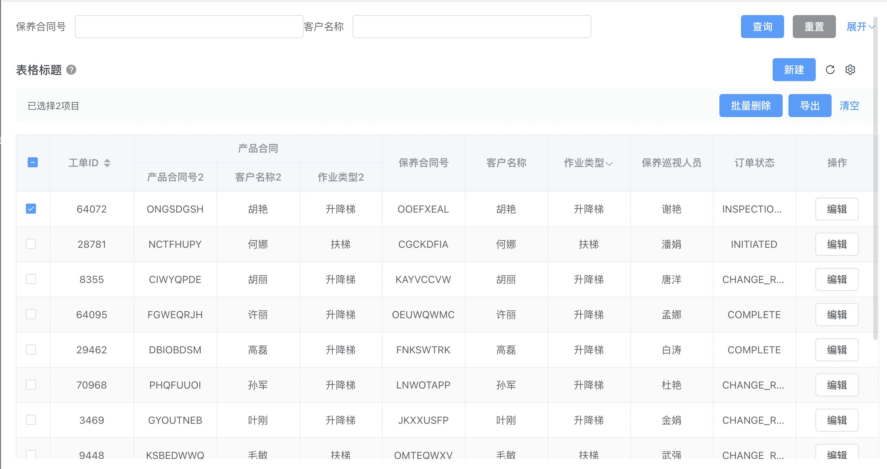
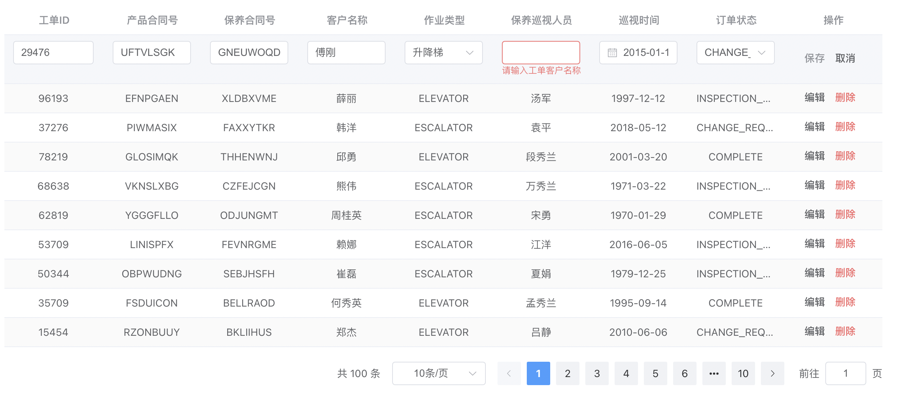

# vue3+vite+element-puls 表格组件封装学习

二次封装 element-plus 的 table 组件，支持头部查询表单和分页显示

```vue
<template>
  <query-filter
    v-if="searchable"
    :fields="fields"
    @submit="onSearch"
    @reset="onReset"
  ></query-filter>
  <el-table v-loading="loading" :data="tableData">
    <template v-for="column in columns">
      <el-table-column v-bind="column" v-if="column.slot">
        <slot :name="column.slot" :column="column"></slot>
      </el-table-column>
      <component
        v-else-if="column.component"
        :is="column.component"
        :config="column"
      ></component>
      <el-table-column
        v-else
        v-bind="column"
        align="center"
        :show-overflow-tooltip="true"
      ></el-table-column>
    </template>
  </el-table>
  <el-pagination
    v-if="pageConfig"
    class="mt20 flexEnd"
    v-bind="pageConfig"
    :current-page="params.page"
    :page-size="params.pageSize"
    :total="total"
    @size-change="handleSizeChange"
    @current-change="handleCurrentChange"
  />
</template>

<script setup lang="ts" generic="T">
import { IResponse } from '@/api/type'
import { watch, ref, onMounted, computed } from 'vue'
import QueryFilter from '../QueryFilter/index.vue'
import { IField } from '../ProForm/type'

interface ITableColumn extends IField {
  prop: string
  label: string
  hideInSearch?: boolean
  [x: string]: any
}

interface IPageConfig {
  background: boolean
  pageSizes: number[]
  layout: string
}

const props = withDefaults(
  defineProps<{
    columns: ITableColumn[]
    pageConfig?: IPageConfig | false
    searchable?: boolean
  }>(),
  {
    searchable: true,
    pageConfig: {
      background: true,
      pageSizes: [10, 20, 50, 100],
      layout: 'total, sizes, prev, pager, next, jumper',
    },
  }
)

const emit = defineEmits(['request'])

const tableData = ref<T[]>([])
const loading = ref(false)
const total = ref(0)

const initialParams = props.pageConfig
  ? {
      pageSize: 10,
      page: 1,
    }
  : {}

let params = ref<Record<string, any>>(initialParams)

const fields = computed(() => {
  return props.columns.filter((item) => !item.hideInSearch && item.prop)
})

const fetchList = async () => {
  loading.value = true
  emit(
    'request',
    params.value,
    (resp: IResponse<{ list: T[]; total: number }>) => {
      if (resp.code === 200) {
        tableData.value = resp.data?.list || []
        total.value = resp?.data?.total
        loading.value = false
      } else {
        loading.value = false
      }
    }
  )
}

const handleSizeChange = (pageSize: number) => {
  params.value = {
    pageSize,
    page: 1,
  }
}

const handleCurrentChange = (page: number) => {
  params.value.page = page
}

const onSearch = (values = {}) => {
  params.value = {
    ...params.value,
    ...values,
    page: initialParams?.page,
  }
}

const onReset = () => {
  params.value = {
    page: initialParams?.page,
    pageSize: params.value.pageSize,
  }
}

watch(
  params,
  () => {
    fetchList()
  },
  {
    deep: true,
  }
)

onMounted(() => {
  fetchList()
})
</script>
<style scoped lang="scss">
.flexEnd {
  display: flex;
  align-items: center;
  justify-content: flex-end;
}
</style>
```

## 关于 ref 和 reactive 的响应式问题

vue 文档说
ref 对象是可更改的响应式的，对 value 的所有操作都将被追踪，并且写操作会触发与之相关的副作用。
reactive 的响应式是深层次的，会影响所有的嵌套

因此我想 params 是使用 reactive 实现响应式会比较好，但是在实际应用中

对 params 进行整体赋值的修改，没有触发到 watch 变化，需要对 params 的属性值一个一个进行修改

查询之后得到原因是，因为把对象直接赋值给 reactive 创建的对象，会导致 reactive 创建的对象被新赋值的对象直接代理，而 vue3 中都是 proxy 代理对象，就失去了响应式

可以看这个博客的说明[vue3 中 reactive 赋值，不能响应式变化](https://juejin.cn/post/7202961375554699322)

## 使用

```vue
<template>
  <pro-table :columns="columns" @request="request">
    <template #inspectionType="{ row }">
      {{ row?.inspectionType === 'ELEVATOR' ? '升降梯' : '扶梯' }}
    </template>
  </pro-table>
</template>

<script setup lang="ts">
import { ProTable } from '@/components'
import { getTableList } from '@/api/components'
import { readonly } from 'vue'

const columns = readonly([
  { type: 'selection' },
  {
    prop: 'inspectionId',
    label: '工单ID',
    hideInSearch: true,
  },
  {
    prop: 'eleContractNo',
    label: '产品合同号',
    type: 'input',
  },
  {
    prop: 'mntContractNo',
    label: '保养合同号',
    type: 'input',
  },
  {
    prop: 'customerName',
    label: '客户名称',
    type: 'input',
  },
  {
    prop: 'inspectionType',
    label: '作业类型',
    slot: 'inspectionType',
    type: 'select',
    fieldProps: {
      options: [
        { label: '升降梯', value: 'ELEVATOR' },
        { label: '扶梯', value: 'ESCALATOR' },
      ],
    },
  },
  {
    prop: 'userName',
    label: '保养巡视人员',
    type: 'input',
  },
  {
    prop: 'inspectionDate',
    label: '巡视时间',
    type: 'datePicker',
  },
  {
    prop: 'orderCode',
    label: '订单状态',
    type: 'select',
    fieldProps: {
      options: [
        'INITIATED',
        'CHANGE_REQUEST',
        'INSPECTION_AUDIT',
        'COMPLETE',
      ].map((item) => ({ label: item, value: item })),
    },
  },
])

const request = async (params, cb) => {
  const resp = await getTableList(params)
  cb?.(resp)
}
</script>
<style scoped></style>
```

## 效果



# 支持多级表头

其实就是递归 el-table-column 和 slots 嵌套的问题

重新封装一下 table-column，如果是多级表头的话就递归一下

```vue
<!-- ProTableColumn.vue -->
<template v-if="column.children && column.children.length > 0">
  <pro-table-column
    v-for="(child, index) in column.children"
    :key="`pro-table-column__${child.prop || child.label || index}`"
    :column="child"
  >
    <template v-for="(_, slot) in $slots" :key="slot" #[slot]="slotScope">
      <slot :name="slot" v-bind="slotScope" />
    </template>
  </pro-table-column>
</template>
```

```vue
<!-- ProTable.vue -->
<el-table
  ref="tableRef"
  v-loading="loading"
  :data="tableData"
  :row-key="rowKey"
  :current-row-key="rowKey"
  @selection-change="onSelectionChange"
  v-bind="$attrs"
>
  <pro-table-column
    v-for="column in computedColumns"
    v-show="!column.hidden || !column.hideInTable"
    :key="column.prop"
    :column="column"
  >
    <template v-for="(_, slot) in $slots" #[slot]="scope">
      <slot :name="slot" v-bind="scope" />
    </template>
  </pro-table-column>
</el-table>
```

## 效果



# 新增支持行内编辑和表单校验

修改一下 ProTableColumn 组件，如果是 edit 状态就返回一个 form-item

然后二次封装一下 pro-table，支持一下 v-model 指令

需要注意的是 form-item 的 prop 是 name.index.prop，在 form-item 绑定 prop 时 和 validateFields 时要一致

```vue
<pro-form-item
  v-if="
    scope.row.isEdit &&
    ('editable' in column ? column?.editable : true) &&
    column.prop
  "
  :field="omit(column, ['prop', 'label'])"
  label=""
  :rules="rules?.[column.prop]"
  :prop="`${formItem?.prop || 'tableData'}.${scope.$index}.${column.prop}`"
  :component="column.formItemComponent || column.component"
  v-model="scope.row[column.prop]"
></pro-form-item>
```

自定义组件触发 form-item 的 规则校验，需要通过 useFormItem hook

获取到 formItem 实例，在 modelValue 修改的时候调用 formItem?.validate('change')

```ts
import { useFormItem } from 'element-plus'

const { formItem, form } = useFormItem()

emit('update:modelValue', unref(tableData) as T[])
formItem?.validate('change', (isValid, errors) => {
  console.log(isValid, errors)
})
formItem?.validate('blur')
```

## 效果



学习到了～～
el-form 的 [useFormItem hook](https://github.com/element-plus/element-plus/blob/dev/packages/components/form/src/form.vue) 通过 provide 和 inject 实现的
