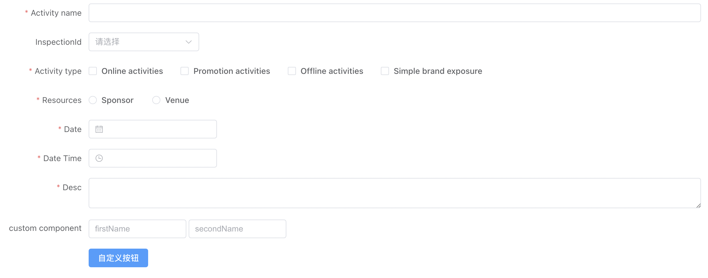

# vue3+vite+element-puls 表单组件封装学习

## form-item 表单项封装

Field 是根据 type 渲染的 element-plus 组件，例如 input、select 等
也支持自定义 component 组件，组件需要支持 v-model

```vue
<template>
  <component v-if="field.component" :is="field.component" v-bind="$attrs" />

  <Field
    v-else
    :type="field.type"
    :fieldProps="field?.fieldProps || {}"
    v-bind="$attrs"
  ></Field>
</template>

<script setup lang="ts">
import Field from './Field.vue'
import { defineProps } from 'vue'
import type { IField } from './type'
defineProps<{ field: IField }>()
</script>
<style scoped></style>
```

## pro-form 表单封装

主要是循环渲染 fields，接收一个 request 方法通过接口请求获取表单的初始化数据

but 在 react 中可以通过判断 props.request 是否存在来决定是否请求，在 vue3 中不知道怎么判断，所以用了 try finally 无论如何将 loading 状态设为 false

```vue
<template>
  <el-form
    v-loading="loading"
    :model="formValues"
    ref="formRef"
    v-bind="config"
  >
    <el-form-item
      v-for="field in fields"
      v-bind="field"
      :key="field.prop"
      :name="field.prop"
    >
      <form-item
        :field="field"
        :formValues="formValues"
        :formRef="formRef"
        v-model="formValues[field.prop]"
      >
      </form-item>
    </el-form-item>
    <el-form-item v-if="submitter || $slots.submitter">
      <slot name="submitter" :formValues="formValues" :formRef="formRef">
        <form-submitter
          v-bind="submitter"
          @submit="onSubmit"
          @reset="onReset"
        ></form-submitter>
      </slot>
    </el-form-item>
  </el-form>
</template>

<script setup lang="ts" generic="T=Record<string,any>">
import { defineProps, ref, onMounted } from 'vue'
import type { FormInstance } from 'element-plus'
import FormItem from './FormItem.vue'
import FormSubmitter from './Submitter.vue'
import { IFormProps, IFormEmits, IFormExpose } from './type'

const props = defineProps<IFormProps<T>>()

const emit = defineEmits<IFormEmits>()

const formRef = ref<FormInstance>()

let formValues = ref<T>((props.model || {}) as T)

const loading = ref(false)

const request = () => {
  loading.value = true
  try {
    emit('request', (values) => {
      formValues.value = values
      loading.value = false
    })
  } finally {
    loading.value = false
  }
}

const onSubmit = () => {
  if (!formRef.value) return
  formRef.value.validate((valid) => {
    if (valid) {
      emit('submit', formValues.value)
    } else {
      return false
    }
  })
}

const onReset = () => {
  if (!formRef.value) return
  formRef.value.resetFields()
  emit('reset')
}

onMounted(() => {
  request?.()
})

defineExpose<IFormExpose<T>>({
  onSubmit,
  onReset,
  formValues: formValues.value,
  ...(formRef.value || {}),
})
</script>
<style scoped lang="scss"></style>
```

## 使用

```vue
<template>
  <!-- 直接使用 -->
  <pro-form
    label-width="150px"
    :rules="rules"
    :fields="fields"
    @request="fetchFormDetail"
    @submit="onSubmit"
    @reset="onReset"
  >
  </pro-form>
  <!-- 自定义按钮 -->
  <pro-form label-width="150px" :rules="rules" :fields="fields">
    <template #submitter="{ formValues, formRef }">
      <el-button type="primary" @click="formBtnAction(formValues, formRef)"
        >自定义按钮</el-button
      >
    </template>
  </pro-form>
</template>

<script setup lang="ts">
import { ProForm } from '@/components'
import CustomComponet from './customComponet.vue'
import { getTableList, getFormDetail } from '@/api/components'
import { ref, reactive, onMounted, readonly, shallowRef } from 'vue'

let fields = reactive([
  {
    label: 'Activity name',
    prop: 'name',
    type: 'input',
    required: true,
  },
  {
    label: 'InspectionId',
    prop: 'inspectionId',
    type: 'select',
    fieldProps: {
      options: [],
    },
  },
  {
    label: 'Activity type',
    prop: 'type',
    type: 'checkbox',
    fieldProps: {
      options: [
        {
          label: 'Online activities',
          value: '1',
        },
        {
          label: 'Promotion activities',
          value: '2',
        },
        {
          label: 'Offline activities',
          value: '3',
        },
        {
          label: 'Simple brand exposure',
          value: '4',
        },
      ],
    },
  },
  {
    label: 'Resources',
    prop: 'resource',
    type: 'radio',
    fieldProps: {
      options: [
        {
          label: 'Sponsor',
          value: '1',
        },
        {
          label: 'Venue',
          value: '2',
        },
      ],
    },
  },
  {
    label: 'Date',
    prop: 'date',
    type: 'datePicker',
    fieldProps: {
      type: 'date',
      clearable: true,
    },
  },
  {
    label: 'Date Time',
    prop: 'dateTime',
    type: 'datePicker',
    fieldProps: {
      type: 'datetime',
      clearable: true,
      format: 'YYYY-MM-DD HH:mm:ss',
    },
  },
  {
    label: 'Desc',
    prop: 'desc',
    type: 'input',
    fieldProps: {
      type: 'textarea',
    },
  },
  {
    label: 'custom component',
    prop: 'custom',
    // 这里是接收封装的自定义组件
    component: shallowRef(CustomComponet),
  },
])

const rules = readonly({
  name: [
    { required: true, message: 'Please input Activity name', trigger: 'blur' },
    { min: 3, max: 5, message: 'Length should be 3 to 5', trigger: 'blur' },
  ],
  count: [
    {
      required: true,
      message: 'Please select Activity count',
      trigger: 'change',
    },
  ],
  date: [
    {
      type: 'date',
      required: true,
      message: 'Please pick a date',
      trigger: 'change',
    },
  ],
  dateTime: [
    {
      type: 'date',
      required: true,
      message: 'Please pick a time',
      trigger: 'change',
    },
  ],
  type: [
    {
      type: 'array',
      required: true,
      message: 'Please select at least one activity type',
      trigger: 'change',
    },
  ],
  resource: [
    {
      required: true,
      message: 'Please select activity resource',
      trigger: 'change',
    },
  ],
  desc: [
    { required: true, message: 'Please input activity form', trigger: 'blur' },
  ],
})

const onReset = () => {
  console.log('onReset')
}
const formBtnAction = (values, instance) => {
  console.log(values, instance)
}

const onSubmit = (values) => {
  console.log('onSubmit===>', values)
}

// 动态请求select数据
const fetchList = async () => {
  const resp = await getTableList({})
  if (resp.code === 200) {
    fields = fields.map((item) => {
      if (item.prop === 'inspectionId') {
        item.fieldProps.options = resp?.data?.list?.map((item) => ({
          label: item.customerName,
          value: item.inspectionId,
        }))
      }
      return item
    })
  }
}

const fetchFormDetail = async (cb) => {
  const resp = await getFormDetail()
  if (resp.code === 200) {
    cb(resp.data)
  }
}

onMounted(() => {
  fetchList()
})
</script>
<style scoped></style>
```

## 效果


